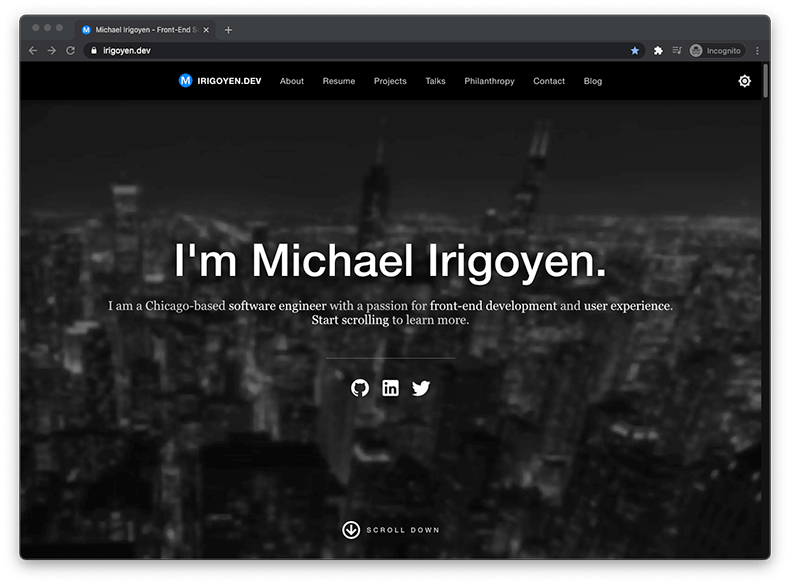

<h1 align="center">
  irigoyen.dev
</h1>

  

    Built with <a href="https://preactjs.com/" target="_blank">Preact</a> and <a href="https://www.typescriptlang.org/" target="_blank">TypeScript</a>. Hosted with <a href="https://www.netlify.com/" target="_blank">Netlify</a>.
  

  

    
  

  

    
  

## Why Preact?

Knowing that my site was going to be mostly static content, I wanted to make sure the overall weight of the assets sent to my visitors was extremely small. Preact's size is right about 3KB (compared to React's 45KB).

Preact also has some nice tooling around pre-rendering built-in. In the case of this site, everything is pre-rendered. The JavaScript serves as an enhancement layer on top of the content; the site doesn't require JavaScript to be enabled to function properly.

## Why TypeScript? Why JavaScript at all?

Simply, more practice. React's ecosystem is something I am very comfortable with. I wanted to organize my code in familiar ways and have the ability to tap into some of the nicer pieces of React.

This was also my first major plunge into TypeScript. I haven't had an opportunity to use TypeScript in a professional setting yet, so I wanted to begin to get more familiar with its intricacies.

## Can I play with this repo?

Absolutely! Here's some key information to help you get started:

1. Clone this repository.
2. Run `npm install` to install the dependencies.
   - I used Node v14 and NPM v7 when creating it.
3. Run `npm run dev` to start the development server.
4. You can find the site at <http://localhost:8080>.

## Legal

&copy; Copyright 2020-2022 Michael Irigoyen

I've spent a lot of time making my site personal to me. Feel free to mess around with the code as you want, but if you would like to reuse any of it for your own projects, please reach out to me for permission.
